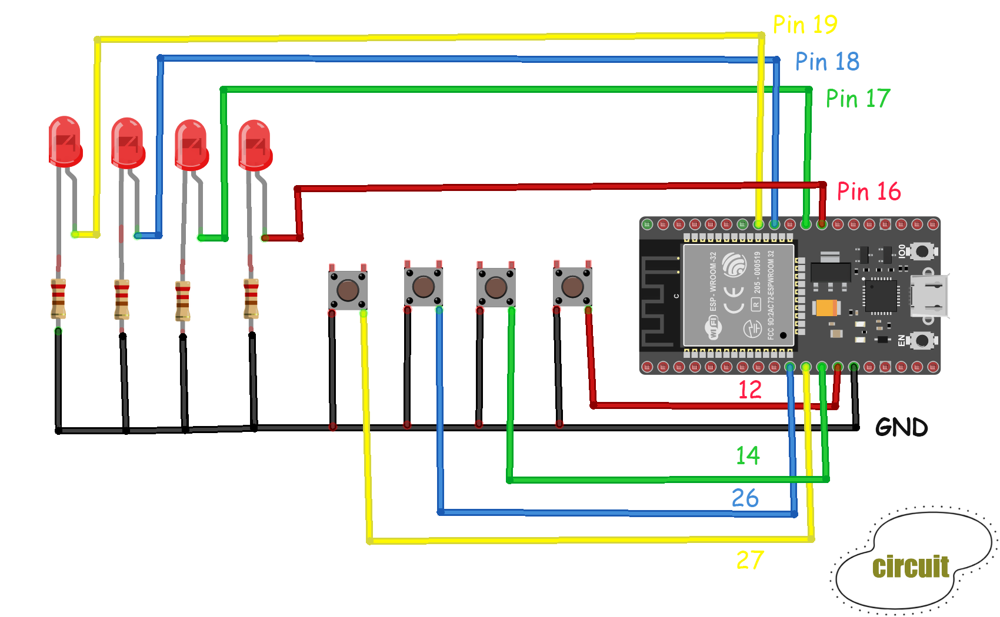

# ESP32-Smart-Home
Système de domotique IoT basé sur l'ESP32 avec interface web asynchrone et boutons physiques.

## 📺 Démonstration en vidéo

Voici une démonstration du fonctionnement du dashboard web contrôlant la maquette en temps réel :

## 🛠️ Montage et Câblage

Le circuit a été conçu sur breadboard selon le schéma suivant :

